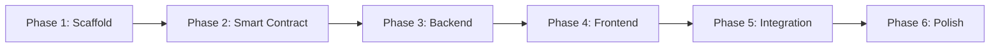

# Implementation Plan — Decentralized KYC Platform

> Based on the [approved architecture](file:///C:/Users/deeks/.gemini/antigravity-ide/brain/1d10fbba-44a4-430c-87c3-3efa8b414b6d/architecture.md)

## Execution Strategy

The build is divided into **6 phases**, each independently verifiable. Dependencies flow top-down — each phase builds on the previous.

---

## Phase 1 — Project Scaffolding & Configuration

**Goal**: Initialize all three sub-projects and shared config so that `npm install` succeeds in each directory.

### [NEW] `contracts/` — Hardhat Project

| File | Purpose |
|---|---|
| `contracts/hardhat.config.js` | Hardhat config — Solidity 0.8.x compiler, Ganache network (`localhost:7545`) |
| `contracts/package.json` | Dependencies: `hardhat`, `@nomicfoundation/hardhat-ethers`, `ethers`, `chai` |
| `contracts/.env` | `GANACHE_URL`, `DEPLOYER_PRIVATE_KEY` |

### [NEW] `backend/` — Express Project

| File | Purpose |
|---|---|
| `backend/package.json` | Dependencies: `express`, `mongoose`, `jsonwebtoken`, `bcryptjs`, `multer`, `axios`, `dotenv`, `cors`, `helmet`, `express-rate-limit`, `express-validator`, `ethers` |
| `backend/.env` | `PORT`, `MONGO_URI`, `JWT_SECRET`, `AES_MASTER_KEY`, `GANACHE_URL`, `CONTRACT_ADDRESS`, `PINATA_API_KEY`, `PINATA_SECRET_KEY` |
| `backend/server.js` | Minimal Express app — loads env, connects MongoDB, mounts placeholder routes, starts server on port 5000 |
| `backend/config/db.js` | Mongoose connection with retry logic |

### [NEW] `frontend/` — Vite + React Project

| File | Purpose |
|---|---|
| `frontend/` | Scaffold via `npx create-vite` (React template) |
| `frontend/.env` | `VITE_API_URL=http://localhost:5000/api` |
| `frontend/vite.config.js` | Proxy `/api` to backend in dev mode |

### [NEW] Root Files

| File | Purpose |
|---|---|
| `.gitignore` | Ignore `node_modules/`, `.env`, `artifacts/`, `cache/`, `uploads/` |
| `README.md` | Project overview with setup instructions |

### Verification
- `npm install` succeeds in all three directories
- `npx hardhat compile` runs (no contracts yet, but no errors)
- `node backend/server.js` starts and connects to MongoDB
- `npm run dev` in frontend shows Vite welcome page

---

## Phase 2 — Smart Contract (Layer 1)

**Goal**: Complete, tested, and locally deployed Solidity contract.

### [NEW] `contracts/contracts/KYCContract.sol`

Core implementation:

- **State variables**: 
  - `mapping(address => Document) documents` — citizen → {docHash, ipfsCID, isVerified, kycId}
  - `mapping(string => address) kycIdToCitizen` — kycId → citizen address
  - `mapping(string => mapping(address => bool)) accessPermissions` — kycId → company → granted
  - `mapping(address => bool) verifiers` — authorized verifier addresses
  - `address owner` — contract deployer

- **Modifiers**: `onlyOwner`, `onlyVerifier`, `onlyCitizen(address)`

- **Functions** (per architecture §8):
  - `registerDocument(bytes32 docHash, string ipfsCID)`
  - `verifyKYC(address citizen, string kycId)`
  - `rejectKYC(address citizen)`
  - `requestAccess(string kycId)`
  - `approveAccess(string kycId, address company)`
  - `revokeAccess(string kycId, address company)`
  - `checkAccess(string kycId, address company) → bool` (view)
  - `getDocument(address citizen) → (bytes32, string)` (view)
  - `addVerifier(address)` / `removeVerifier(address)` — owner-only admin

- **Events**: `DocumentRegistered`, `KYCVerified`, `KYCRejected`, `AccessRequested`, `AccessApproved`, `AccessRevoked`

### [NEW] `contracts/scripts/deploy.js`

- Deploy `KYCContract` to Ganache
- Log deployed contract address
- Optionally register the deployer as a verifier

### [NEW] `contracts/test/KYCContract.test.js`

- Test all functions and access control modifiers
- Test event emissions
- Test edge cases (duplicate registration, unauthorized access)

### Verification
- `npx hardhat test` — all tests pass
- `npx hardhat run scripts/deploy.js --network localhost` — contract deploys to Ganache
- Contract address logged and usable

---

## Phase 3 — Backend API (Layers 2 & 3)

**Goal**: Fully functional REST API with all routes, services, and middleware.

### 3A — Models (MongoDB Schemas)

| File | Schema |
|---|---|
| `backend/models/User.js` | `{ name, email, password, role, walletAddress, kycId, timestamps }` — pre-save hook for bcrypt |
| `backend/models/KYCDocument.js` | `{ userId, documentType, ipfsCID, docHash, txHash, encryptionKey, status, verifiedBy, kycId, timestamps }` |
| `backend/models/AccessRequest.js` | `{ requestedBy, citizenId, kycId, status, consentTxHash, requestedAt, respondedAt }` |
| `backend/models/Notification.js` | `{ userId, message, type, isRead, relatedId, createdAt }` |

### 3B — Services

| File | Responsibility |
|---|---|
| `backend/services/cryptoService.js` | `encryptDocument(buffer)` → `{encrypted, key, iv}` using AES-256-CBC. `decryptDocument(encrypted, key, iv)` → buffer. `hashDocument(buffer)` → SHA-256 hex. Key encrypted with master key from env. |
| `backend/services/ipfsService.js` | `uploadToIPFS(encryptedBuffer, fileName)` → CID via Pinata API. `fetchFromIPFS(cid)` → encrypted buffer. Uses `axios` with Pinata REST endpoints. |
| `backend/services/blockchainService.js` | Initialize `ethers.Contract` with ABI + address from env. Expose: `registerDocumentOnChain(docHash, ipfsCID)`, `verifyKYCOnChain(citizenAddr, kycId)`, `rejectKYCOnChain(citizenAddr)`, `requestAccessOnChain(kycId)`, `approveAccessOnChain(kycId, companyAddr)`, `revokeAccessOnChain(kycId, companyAddr)`, `checkAccessOnChain(kycId, companyAddr)`, `getDocumentFromChain(citizenAddr)`. |

### 3C — Middleware

| File | Responsibility |
|---|---|
| `backend/middleware/authMiddleware.js` | Verify JWT from `Authorization: Bearer <token>` header. Attach `req.user = { userId, role, walletAddress }`. Reject 401 if invalid/expired. |
| `backend/middleware/roleMiddleware.js` | Factory: `authorize(...roles)` → middleware that checks `req.user.role` against allowed roles. Reject 403 if unauthorized. |

### 3D — Controllers & Routes

**Auth** (`backend/controllers/authController.js` + `backend/routes/authRoutes.js`)
- `POST /api/auth/register` — validate input, hash password, create user, return JWT
- `POST /api/auth/login` — validate credentials, return JWT

**KYC** (`backend/controllers/kycController.js` + `backend/routes/kycRoutes.js`)
- `POST /api/kyc/submit` — [citizen] Multer upload → hash original → encrypt → upload to IPFS → register on-chain → save metadata to MongoDB → create notification
- `GET /api/kyc/status` — [citizen] return own KYC documents and statuses
- `GET /api/kyc/pending` — [verifier] list all documents with status "pending"
- `POST /api/kyc/verify/:id` — [verifier] generate KYC ID → update on-chain → update MongoDB → notify citizen
- `POST /api/kyc/reject/:id` — [verifier] reject on-chain → update MongoDB → notify citizen

**Access** (`backend/controllers/accessController.js` + `backend/routes/accessRoutes.js`)
- `POST /api/access/request` — [company] create access request → log on-chain event → notify citizen
- `GET /api/access/requests` — [citizen] list pending access requests for own KYC
- `POST /api/access/approve/:id` — [citizen] approve on-chain → update MongoDB → notify company
- `POST /api/access/deny/:id` — [citizen] deny → update MongoDB → notify company
- `POST /api/access/revoke/:id` — [citizen] revoke on-chain → update MongoDB → notify company
- `GET /api/access/document/:kycId` — [company] if approved: fetch from IPFS → decrypt → verify hash vs on-chain → return document

**Notifications** (`backend/controllers/notificationController.js` + `backend/routes/notificationRoutes.js`)
- `GET /api/notifications` — [authenticated] get own notifications
- `PATCH /api/notifications/:id/read` — [authenticated] mark as read

### 3E — Wire Everything in `server.js`

- Apply `helmet`, `cors`, `express.json`, `express-rate-limit`
- Mount all route modules
- Global error handler middleware

### Verification
- Backend starts without errors
- Auth endpoints return JWT
- KYC submit endpoint encrypts, uploads to Pinata, registers on-chain
- Access flow works end-to-end via REST client (Postman/curl)

---

## Phase 4 — Frontend (React + Vite)

**Goal**: Role-based SPA with all 3 dashboards, auth flow, and API integration.

### 4A — Core Setup

| File | Purpose |
|---|---|
| `frontend/src/main.jsx` | Render `<App />` wrapped in `AuthProvider` |
| `frontend/src/App.jsx` | React Router with public routes (Login, Register) and protected role-based routes |
| `frontend/src/api/axios.js` | Axios instance: base URL from env, request interceptor to attach JWT, response interceptor for 401 redirect |
| `frontend/src/context/AuthContext.jsx` | Context with `user`, `token`, `login()`, `logout()`, `register()`. Persist token in localStorage. |
| `frontend/src/hooks/useAuth.js` | `useContext(AuthContext)` shorthand |
| `frontend/src/routes/ProtectedRoute.jsx` | Check auth + role, redirect to login or 403 |

### 4B — Shared Components (`frontend/src/components/common/`)

| Component | Purpose |
|---|---|
| `Navbar.jsx` | Top nav with role badge, notifications bell, logout |
| `Sidebar.jsx` | Role-contextual navigation links |
| `Loader.jsx` | Spinner for async operations |
| `NotificationPanel.jsx` | Dropdown panel listing notifications with mark-as-read |
| `StatusBadge.jsx` | Color-coded status chip (pending/verified/rejected/approved/denied) |
| `FileUpload.jsx` | Drag-and-drop document upload component |

### 4C — Pages

| Page | Role | Features |
|---|---|---|
| `Login.jsx` | Public | Email + password form, role selection, redirect to dashboard |
| `Register.jsx` | Public | Name, email, password, role, wallet address |
| `CitizenDashboard.jsx` | Citizen | Upload documents, view KYC status, view/respond to access requests, KYC ID display, notifications |
| `VerifierDashboard.jsx` | Verifier | Pending submissions list, approve/reject with KYC ID assignment, verification history |
| `CompanyDashboard.jsx` | Company | Request access by KYC ID, view request statuses, view approved documents, integrity verification result |
| `NotFound.jsx` | Public | 404 page |

### 4D — Role-Specific Components

**Citizen** (`frontend/src/components/citizen/`)
- `DocumentUploadForm.jsx` — select doc type (Aadhaar/PAN/Passport), file upload, submit
- `KYCStatusCard.jsx` — shows status per document type with KYC ID
- `AccessRequestsList.jsx` — lists incoming requests with approve/deny buttons

**Verifier** (`frontend/src/components/verifier/`)
- `PendingSubmissionsList.jsx` — table of pending KYC submissions
- `VerificationCard.jsx` — view document details, approve/reject actions

**Company** (`frontend/src/components/company/`)
- `AccessRequestForm.jsx` — input KYC ID, request access
- `RequestStatusList.jsx` — track own requests
- `DocumentViewer.jsx` — display retrieved document + integrity status

### 4E — Styling (`frontend/src/styles/index.css`)

- Premium dark theme with glassmorphism cards
- CSS custom properties design system (colors, spacing, typography)
- Inter font from Google Fonts
- Smooth transitions and micro-animations
- Responsive layout with CSS Grid / Flexbox
- Status-specific color coding (green=verified, amber=pending, red=rejected)

### Verification
- `npm run dev` runs without errors
- Login → Register flow works
- Each role sees their correct dashboard
- All components render with styling

---

## Phase 5 — Integration & End-to-End Testing

**Goal**: All 3 layers connected and functioning as a complete system.

### Tasks

1. **Start Ganache** → deploy contract → copy address to `backend/.env`
2. **Copy ABI** from `contracts/artifacts/` to `backend/services/` (or load dynamically)
3. **Configure Pinata** API keys in `backend/.env`
4. **Full flow test**:
   - Register a citizen, verifier, and company
   - Citizen uploads an Aadhaar document → encrypted → IPFS → on-chain
   - Verifier sees pending → approves → KYC ID generated
   - Company requests access using KYC ID → citizen notified
   - Citizen approves → company retrieves document
   - Integrity check passes (hash match)
5. **Edge cases**: rejected KYC, denied access, revoked access, duplicate submissions

### Verification
- Complete citizen → verifier → company flow works via the UI
- Blockchain events are emitted and visible in Ganache
- IPFS CIDs resolve via Pinata gateway
- Document integrity verification succeeds

---

## Phase 6 — Security Hardening & Polish

**Goal**: Production-grade security, error handling, and UX polish.

### Tasks

1. **Input validation** on all backend routes using `express-validator`
2. **Error handling** — global error middleware, consistent JSON error responses
3. **Rate limiting** — stricter limits on `/auth/login` (brute-force protection)
4. **File upload validation** — MIME type whitelist, max 10 MB
5. **Frontend error boundaries** — graceful error UI
6. **Loading states** — skeleton loaders during async operations
7. **Toast notifications** — success/error feedback on actions
8. **Final README** — updated setup instructions, environment variable documentation

### Verification
- Invalid inputs return proper 4xx errors
- Rate limiting blocks rapid requests
- Oversized / wrong-type file uploads are rejected
- UI shows loading states and error messages gracefully

---

## Open Questions

> [!IMPORTANT]
> These decisions won't block Phase 1–2 but will affect Phase 3 onwards.

1. **Pinata API keys** — Do you already have a Pinata account and API keys, or should I add instructions to the README for creating one?

2. **Ganache setup** — Are you using Ganache CLI (`ganache`) or the Ganache GUI application? This affects the default port and configuration.

3. **Multiple documents per citizen** — Should a citizen be able to upload multiple document types (Aadhaar + PAN + Passport) under one KYC ID, or is it one document = one KYC ID?

4. **Wallet address generation** — Should users provide their own Ethereum wallet address at registration, or should the backend auto-generate one?

---

## Execution Order Summary

| Phase | Effort Estimate | Files Created |
|---|---|---|
| Phase 1: Scaffold | ~10 files | Config, package.json, server.js, .env templates |
| Phase 2: Smart Contract | ~3 files | KYCContract.sol, deploy.js, test file |
| Phase 3: Backend | ~18 files | Models, services, middleware, controllers, routes |
| Phase 4: Frontend | ~20+ files | Pages, components, context, styles |
| Phase 5: Integration | ~2 files | ABI copy, config updates |
| Phase 6: Polish | Edits to existing | Validation, error handling, README |

> [!CAUTION]
> **Awaiting approval.** Please review this plan, answer the open questions if possible, and approve to begin Phase 1.
